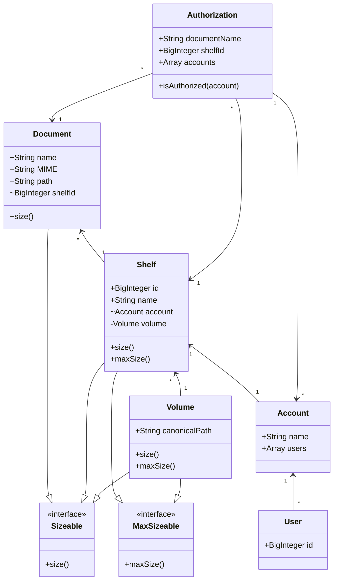

# chai4
A file storage service in node

## 1. Howto

- Build the project

```
yarn
```

or...

```
npm install
```


- Run the project in the development environment

```
yarn dev
```

or alternatively...

```
npm run dev
```

- Go to your browser at "http://localhost:8082". You should see a welcome message from _chai4_

## 2. How it will work

Every _chai4_ `Document` is associated with an `Account`, that have several shelves (`Shelf`).



### 2.1. The Document Resource

Is a file identified by a `name` which may contain an extension or not, as files do. The document have some `MIME` type as well, identifying it's type (is it a _docx_ , _pdf_, or _exe_ file, for instance?). The document holds a reference for its `Shelf`, the `shelfId`. Documents are persisted on disk and contains a real physical size. Documents are bound to a contract in which they are obliged to offer the calculation of their own sizes (they implement the _interface_ `Sizeable`).


The given operations are possible over a `Document`resource


#### 2.1.1. Find

A `User` must be authorized to find a specific `Document` or to list some or all `Document`s in a `Shelf`. If the `User` is the creator of the `Shelf`, it received this authorization when it created the `Document`. Otherwise, the `User` must be granted the authorization explicitly before the operation happens. 

The `Shelf` _name_  **is required** in any circumstance. There's no cross shelf search for now, so a single name is expected and must be provided.

If a `Document`'s _name_ is specified for the **Find** operation, we'll filter the search to only the document with the given name, and we'll return the file itself for the caller. If no `Document`'s _name_ is provided, we'll return every `Document`'s name and size, in the specified `Shelf`. 


**_TODO: We do need some pagination to be safe_**
